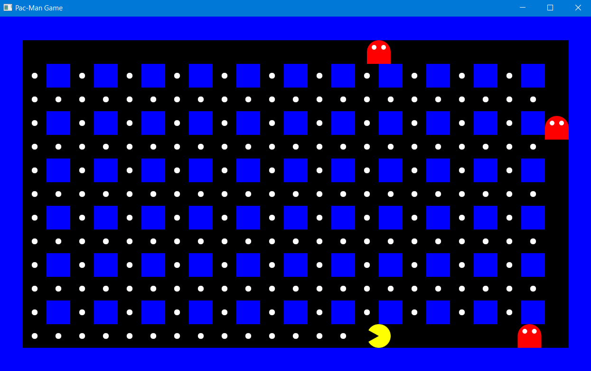
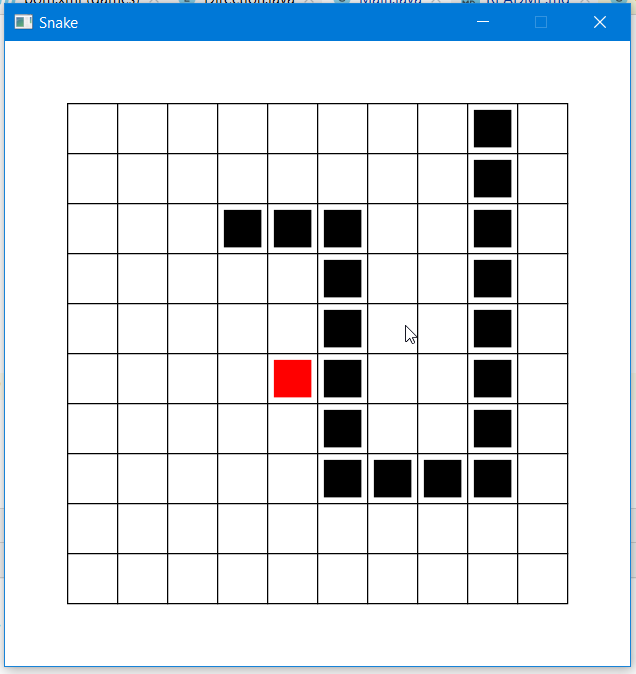

# Games in Java - Object-Oriented Programming with JavaFX

This repository is designed to demonstrate core **Object-Oriented Programming (OOP)** concepts in Java using JavaFX through a series of popular game examples. The goal is to help developers learn and visualize OOP principles in action, from basic class structure to advanced inheritance and encapsulation.

## About This Project

Dive into the code for classic games like **Snake, Chess, Tic-Tac-Toe,** and **Pac-Man** to explore JavaFX's capabilities and understand how OOP principles can structure games effectively. Each game has been carefully crafted to illustrate specific OOP concepts, making it ideal for anyone wanting to learn Java through hands-on projects.

If you have suggestions or encounter issues with this project, please [create a new GitHub issue](https://github.com/peterarsentev/games_oop_javafx/issues).

If you’re looking to deepen your understanding of OOP in Java, 
consider joining the course Mastering Object-Oriented Programming in Java. 
This comprehensive, 104-lesson course is designed to build both a theoretical foundation 
and practical skills essential for applying OOP in real-world scenarios.

## Join for Free! ##

**Contact me on Telegram:** [@parsentev](https://t.me/parsentev)

Let me know if you'd like any further adjustments!

## About the Course: *Mastering Object-Oriented Programming in Java*

### Course Overview

This course, *Mastering Object-Oriented Programming in Java*, is designed to teach and reinforce the foundational concepts of **OOP in Java**. Through 104 structured lessons, you’ll gain both theoretical and practical skills essential for real-world applications.

### Course Structure

Each lesson is organized into three main sections:
- **Theory**: Deep dive into OOP concepts, such as **classes and objects, inheritance, encapsulation, polymorphism,** and **exception handling**.
- **Practice**: Practical examples to demonstrate how each concept is implemented in Java.
- **Exercises**: Coding tasks to reinforce learning and boost problem-solving skills.

### Feedback & Improvement

Every solution you submit receives detailed, personalized feedback. This focuses on best practices and areas for improvement, ensuring continuous growth and a deep understanding of Java's OOP principles.

### Ideal for

This course is perfect for students and developers looking to build a strong OOP foundation in Java, supported by structured lessons and expert feedback.

--- 

Enhance your understanding of **Java OOP** with these interactive projects, and if you're interested, dive deeper with our course to truly master object-oriented programming.

## Game Examples

Here’s a glimpse of what’s inside:

### Pac-Man

### Snake

### Tic-Tac-Toe

### Chess

## Upcoming Features

We are working on bringing more classic games to life:
- **SeaBattle**
- **Tetris**

Stay tuned for these updates!
